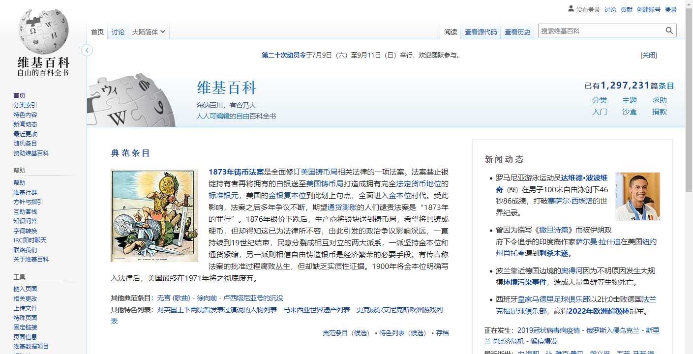

## 背景

> https://zh.wikipedia.org

**维基百科（Wikipedia，聆听i/ˌwɪkɪˈpiːdi.ə/或聆听i/ˌwɪkiˈpiːdi.ə/）是一个自由内容、公开编辑且多语言的网络百科全书协作计划，通过Wiki技术使得包括您在内的所有人都可以简单地使用网页浏览器修改其中的内容**。维基百科的名称取自于本网站核心技术“Wiki”以及具有百科全书之意的“encyclopedia”共同创造出来的新混成词“Wikipedia”，当前维基百科由维基媒体基金会负责运营。

维基百科主要是由来自互联网上的志愿者共同合作编写而成，任何使用网络进入维基百科的用户都可以编写和修改里面的文章，但是在一些情况下为了避免扰乱或者破坏可能会限制编辑功能。我们可以自由选择使用匿名、化名或者直接用真实身份来编辑维基百科。与传统的百科全书相比，在互联网上运作的维基百科其文字和绝大部分图片使用知识共享署名-相同方式共享3.0协议和GNU自由文件许可协议来提供每个人自由且免费的信息，任何人都可以成为条目的作者，以及在遵守协议并标示来源后直接复制、使用以及发布这些内容。

## 相关文章

* [乘风破浪，遇见最美Windows 11之现代Windows桌面应用开发 - 通过MediaWiki API对接海外版维基百科(Wikipedia)](https://www.cnblogs.com/taylorshi/p/16595181.html)